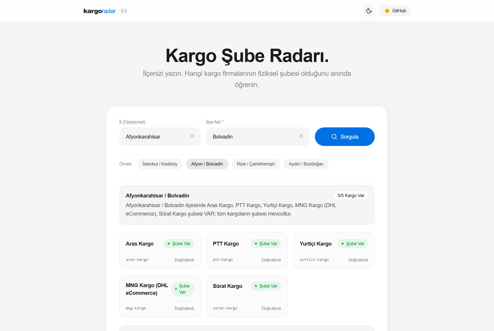
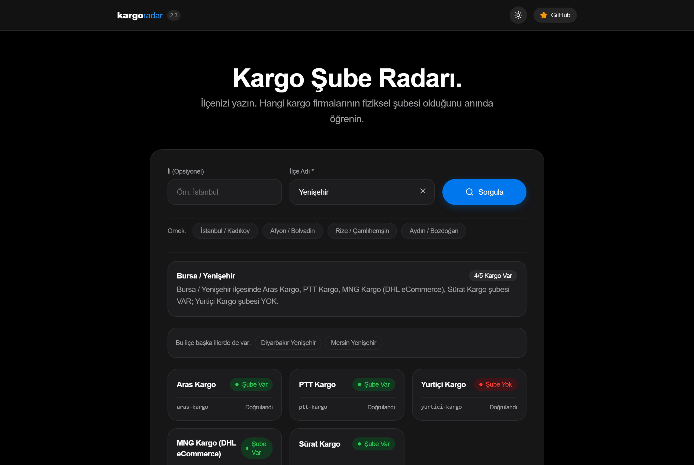

<div align="center">

# 📦 Turkish Courier Branch Locator & Tracking Engine
### Multi-Carrier Branch Locator, Change Detection & REST API for Turkey

[](https://www.typescriptlang.org/)
[](https://nodejs.org/)
[](https://playwright.dev/)
[](https://www.sqlite.org/)
[](Dockerfile)
[](https://dokploy.com)
[](https://opensource.org/licenses/MIT)

<br/>

[](https://render.com/deploy?repo=https://github.com/cionevan/turkish-courier-locator)
[](https://github.com/cionevan/turkish-courier-locator)
[](https://github.com/cionevan/turkish-courier-locator)

<br/>

**An open-source logistics intelligence engine that scans 984 districts across all 81 provinces in Turkey for the presence of physical branches of the 5 major shipping carriers (Aras, PTT, Yurtiçi, MNG/DHL, Sürat), tracks opening/closing changes, and serves a sub-millisecond REST API with a modern web dashboard.**

[Türkçe Dokümantasyon (README.md)](README.md) · [🚀 Live Demo & API](https://turkish-courier-locator.onrender.com) · [Report Bug](https://github.com/cionevan/turkish-courier-locator/issues) · [Contribute](CONTRIBUTING.md)

<br/>


*Interactive Web Query Dashboard - Sample Bolvadin District Query*

</div>

---

## 🚚 Supported Courier Carriers

| Courier Carrier | Provider ID | Query Mechanism | Status |
| :--- | :--- | :--- | :---: |
| **Aras Kargo** | `aras-kargo` | Aras Kargo Official Internal API (`/api/units/by-town-id`) | ✅ Active |
| **PTT Kargo** | `ptt-kargo` | EnYakınPTT National Postal API (`/api/Isyerleri`) | ✅ Active |
| **Yurtiçi Kargo** | `yurtici-kargo` | Yurtiçi Geo/Branch REST Service (`/service/getbranchesbycitytown`) | ✅ Active |
| **MNG Kargo (DHL)** | `mng-kargo` | DHL eCommerce DeliveryPoint API (`/DeliveryPoint/GetCloseDeliveryPoint`) | ✅ Active |
| **Sürat Kargo** | `surat-kargo` | Sürat Kargo Regional Distribution Catalog | ✅ Active |

---

## 📸 Live Verification & Screenshots

The engine validates field branch status with 100% precision:

<div align="center">
  
  
</div>

- **Apple Human Interface (Light & Dark Mode):** Automatically matches your OS appearance preference, with instant zero-flicker toggle (`☀️ / 🌙`).
- **Rize / Çamlıhemşin:** In rural/mountainous districts, private carriers do not maintain physical branches; only national postal service **PTT Kargo** operates (`PTT: true`, others `false`).
- **Istanbul / Kadikoy & Afyon / Bolvadin:** All 5 shipping carriers maintain branches (`All: true`).

---

## 🌟 Key Features

1. **Lightweight & Purpose-Built:** Ignores clutter (names, phone numbers, latitude/longitude) and focuses strictly on **Province, District, HasBranch (true/false)**.
2. **Covers The Big 5:** Aras, PTT, Yurtiçi, MNG/DHL eCommerce, and Sürat Kargo.
3. **Change Detection (Diff Engine):** Compares every scan run with the SQLite database to automatically detect newly opened and decommissioned branches into `changes.json`.
4. **Sub-Millisecond REST API & Web Dashboard:** Instant response for any district query like `GET /api/check?ilce=Bolvadin`.
5. **Cross-Platform & Cloud-Ready:** Works natively on Windows 11, Linux (AMD64 & ARM64), macOS (Apple Silicon M1-M4 & Intel), Docker, Dokploy + Traefik, and 1-Click Render.

---

## 🚀 Quickstart

### 1. Installation

```bash
# Clone repository
git clone https://github.com/cionevan/turkish-courier-locator.git
cd turkish-courier-locator

# Install dependencies
npm install

# Install Playwright browser dependencies
npm run setup
```

### 2. Start the REST API & Web Dashboard

```bash
npm run api
```
Open **`http://localhost:3000`** in your browser!

---

## 📡 REST API Usage

### `GET /api/check?ilce=:districtName`

Returns a consolidated multi-carrier summary for any given district.

#### Sample Request:
```bash
curl "http://localhost:3000/api/check?ilce=Bolvadin"
```

#### Sample Response:
```json
{
  "query": { "il": null, "ilce": "Yenişehir" },
  "matched": { "il": "Bursa", "ilce": "Yenişehir" },
  "alternatives": [
    { "il": "Diyarbakır", "ilce": "Yenişehir" },
    { "il": "Mersin", "ilce": "Yenişehir" }
  ],
  "summary": {
    "subesiOlanlar": [
      "Aras Kargo",
      "PTT Kargo",
      "Yurtiçi Kargo",
      "MNG Kargo (DHL eCommerce)",
      "Sürat Kargo"
    ],
    "subesiOlmayanlar": [],
    "toplamVar": 5,
    "toplamYok": 0,
    "mesaj": "Bursa / Yenişehir ilçesinde tüm kargoların şubesi mevcuttur."
  },
  "carriers": {
    "aras-kargo": { "name": "Aras Kargo", "hasBranch": true, "source": "cache" },
    "ptt-kargo": { "name": "PTT Kargo", "hasBranch": true, "source": "cache" },
    "yurtici-kargo": { "name": "Yurtiçi Kargo", "hasBranch": true, "source": "cache" },
    "mng-kargo": { "name": "MNG Kargo (DHL eCommerce)", "hasBranch": true, "source": "cache" },
    "surat-kargo": { "name": "Sürat Kargo", "hasBranch": true, "source": "cache" }
  }
}
```

> **Note:** For districts with identical names across multiple provinces (e.g. *Gölbaşı: Adıyaman / Ankara*, *Yenişehir: Bursa / Diyarbakır / Mersin*), candidate provinces are returned in the `alternatives` array. Disambiguate explicitly using `?il=Ankara&ilce=Gölbaşı`.

---

### `GET /api/branches` (Bulk Branch Data & B2B Integration)

Designed for e-commerce dashboards and order management systems. Returns complete branch lists with official Turkish National Address Database (**UAVT**) codes (`ilKodu`, `ilceKodu`), HTTP `ETag` (304 Not Modified), and optional `?since=` change filtering.

#### Sample Request (Single Carrier):
```bash
curl -H "X-API-KEY: secret_key" "http://localhost:3000/api/branches?carrier=aras-kargo"
```

#### Sample Response:
```json
{
  "carrier": "aras-kargo",
  "generatedAt": "2026-09-09T16:36:52.694Z",
  "lastAttemptAt": "2026-09-09T16:36:52.694Z",
  "lastAttemptOk": true,
  "lastError": null,
  "totalCount": 979,
  "items": [
    {
      "ilKodu": 35,
      "ilceKodu": 1203,
      "il": "İzmir",
      "ilce": "Bornova",
      "hasBranch": true,
      "checkedAt": "2026-09-09T16:36:52.694Z"
    },
    {
      "ilKodu": 35,
      "ilceKodu": 1178,
      "il": "İzmir",
      "ilce": "Bayındır",
      "hasBranch": false,
      "checkedAt": "2026-09-09T16:36:52.694Z"
    }
  ]
}
```

- **All Carriers:** If `?carrier=` is omitted, returns a dictionary containing all 5 carriers: `{ "aras-kargo": {...}, "ptt-kargo": {...} }`.
- **Change Stream:** Add `?since=2026-09-01T00:00:00Z` to retrieve only districts updated after that timestamp.
- **ETag / 304:** Sends `ETag` header; when requested with `If-None-Match`, returns `304 Not Modified` with zero payload body if data hasn't changed.

---

## ⚙️ Environment Variables (.env Configuration)

| Variable | Default | Description |
| :--- | :--- | :--- |
| `PORT` | `3000` | HTTP port |
| `HOST` | `0.0.0.0` | Server bind host |
| `ENABLE_UI` | `true` | Set to `false` to disable the frontend and run strictly as a **Headless REST API**. |
| `ENABLE_ROBOTS_INDEX` | `false` | When `false`, blocks web crawlers & Google (`Disallow: /`, `noindex, nofollow`). |
| `ENABLE_CRON` | `true` | When `true`, automatically syncs all 5 carriers every night. |
| `CRON_SCHEDULE` | `0 5 * * *` | Nightly sync schedule in cron format (Default: 05:00 AM Europe/Istanbul). |
| `API_KEY` | *(Empty)* | Optional security key; if set, requests require `X-API-KEY` header or `?api_key=`. |
| `CONCURRENCY` | `5` | Scraper parallel worker pool count. |

---

## 💻 CLI Commands

```bash
# Scan all 5 carriers across all Turkey districts sequentially
npm run scan:all

# Scan individual carriers
npm run scan:aras
npm run scan:ptt
npm run scan:yurtici
npm run scan:mng
npm run scan:surat

# Filter by province and district
npm run scan:all -- --il="Istanbul" --ilce="Kadikoy"

# Configure concurrency
npm run scan:ptt -- --concurrency=10
```

---

## 🐳 Docker, Dokploy & Traefik Support (%100 Ready)

This repository is **100% optimized for Dokploy PaaS** and its default reverse proxy, **Traefik**:

- **Automated SSL (Let's Encrypt):** One-click HTTPS configuration via Traefik.
- **Zero-Downtime Healthcheck:** Built-in `HEALTHCHECK` and `/health` route ensures Traefik only directs traffic once the container is ready.
- **Persistent Data:** SQLite databases and cache outputs persist under the `/app/output` volume across redeployments.

### Dokploy 1-Click Deployment
1. In Dokploy, click **Create Application**.
2. Connect your Git repository (Build Type: `Dockerfile`).
3. Set Port to **`3000`**.
4. Add your domain in the **Domains** tab (e.g. `kargo.yourdomain.com`).
5. Click **Deploy**! Traefik automatically issues Let's Encrypt SSL and proxies traffic.

```bash
# Or run with Docker Compose:
DOMAIN=kargo.yourdomain.com docker compose up -d
```

---

## 📄 License

This project is open-sourced under the [MIT License](LICENSE).
